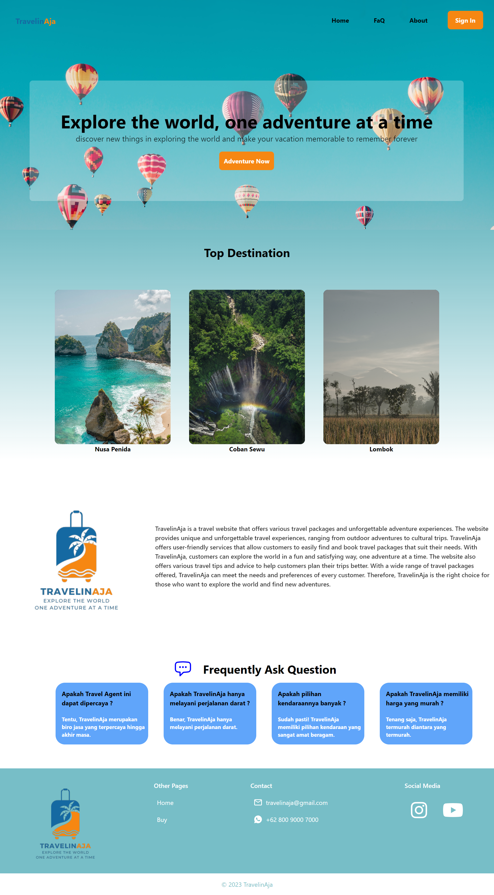
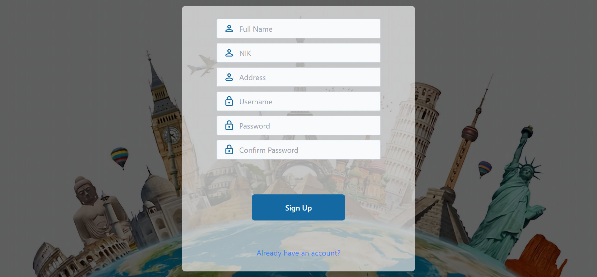
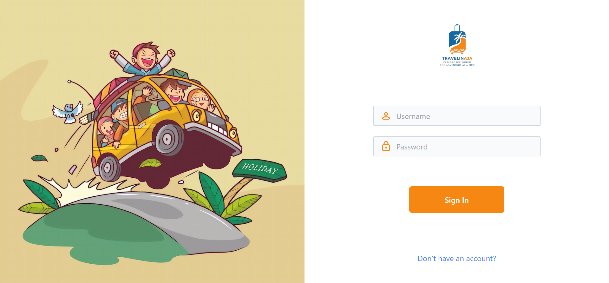
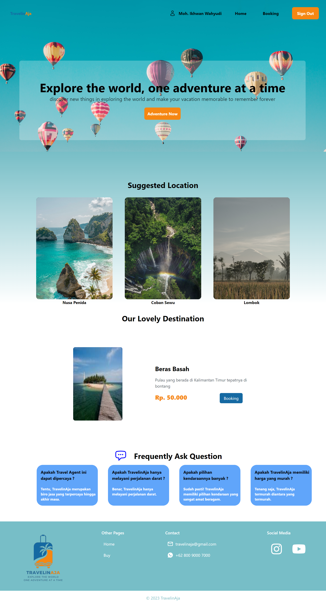
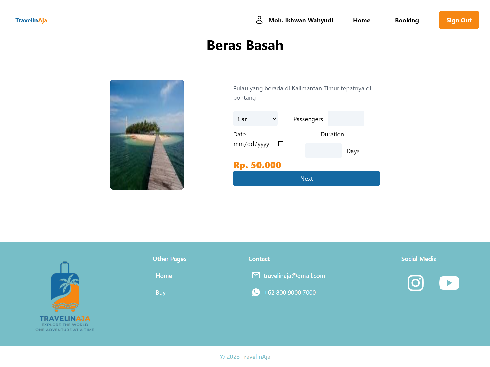
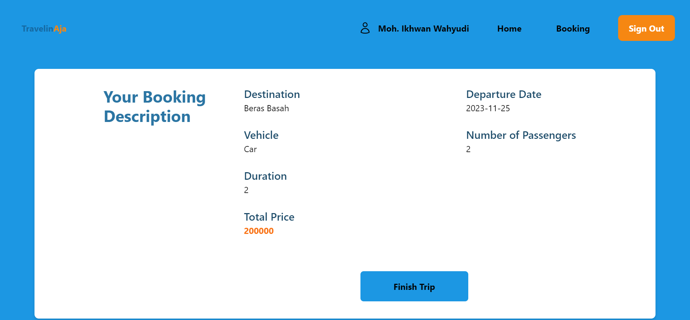

<h1>TravelinAja</h1>

TravelinAja is a website for booking ground transportation tickets.

<h2> Landing Page </h2>

Ini adalah tampilan awal saat pengguna mengakses website.

<h2> Sign Up Page </h2>

Pada halaman ini pengguna dapat melakukan registrasi dan membuat akun.

<h2> Sign In Page </h2>

Pada halaman ini pengguna dapat melakukan log in agar masuk ke dalam website.

<h2> Destination Page</h2>

Pada halaman ini pengguna dapat melihat destinasi yang ingin dituju dan dapat melakukan pemesanan tiket.

<h2> Booking Page </h2>

Pada halaman ini pengguna dapat melihat detail destinasi dan memilih jumlah penumpang .

<h2> History Transaction Page </h2>

Pada halaman ini pengguna dapat melihat riwayat dari pesanan yang telah dilakukan .

